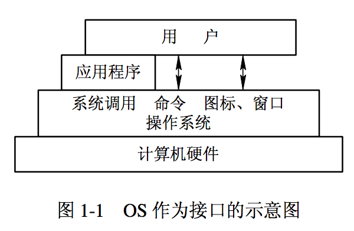
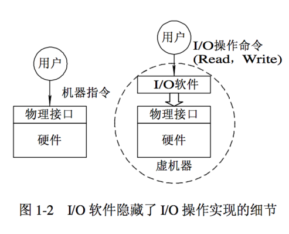
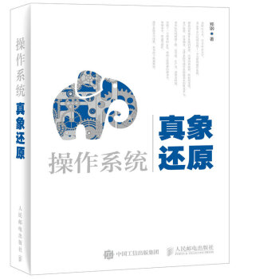
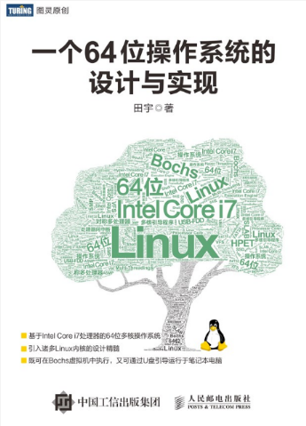
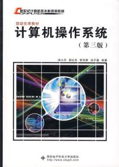
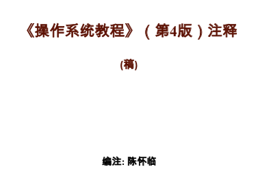
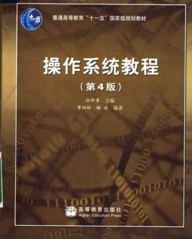

# 计算机操作系统学习笔记

## 本仓库内容

1. 操作系统基本理论
2. 操作系统相关面试题解析

```
Something I hope you know before go into the coding~
First, please watch or star this repo, I'll be more happy if you follow me.
Bug report, questions and discussion are welcome, you can post an issue or pull a request.
```

## 相关站点

* GitHub地址:<https://github.com/yifengyou/learn-os>

* GibBook地址:<https://yifengyou.gitbooks.io/learn-os/content/>

## 目录

* [计算机操作系统](README.md)
* [绪论](docs/index/绪论.md)
* [操作系统结构](docs/osstructure/操作系统结构.md)
* [进程管理](docs/process/进程管理.md)
* [处理机调度与死锁](docs/schedule/处理机调度与死锁.md)
* [内存管理](docs/mem/内存管理.md)
* [文件管理](docs/filesystem/文件管理.md)
* [设备管理](docs/devicemanagement/设备管理.md)
* [系统安全性](docs/security/系统安全性.md)
* [UNIX系统内核结构](docs/unixkernel/UNIX系统内核结构.md)

## 操作系统本质论


* OS的本质是实现了CPU、内存的虚拟化。现代虚拟化技术是再次虚拟化，实现了OS的虚拟化
* OS其实是概念多于理论，技术多于算法。因此把握OS最重要的是把握概念，特别是概念的层次化。
* 计算机系统是由硬件和软件两部分组成。操作系统是配置在计算机硬件上的第一层软件，是对硬件系统的首次扩充。
* OS最重要的概念就是进程（ Process）。可以理解为是操作系统“管理 ”的最小单位。虚存（VM），文件（ File）都属于（Belong to）这个进程的 domain。例如，属于哪个进程的。进程就是一个在运行中的程序，通常是一个 ELF的加载。
* 学习文件系统的时候，不要去纠结驱动程序的实现。类似谈恋爱，非要大家都坦白从幼儿园开始的情史，是大家彼此过不去。要学会“透明”。概念到文件系统，就刹住。否则，为了理解文件系统，非要把 INT13通读，是没有必要的。文件就是文件。
* 文件系统最重要的是控制块（ Control Block）。要知道数据（例如， 512B）在硬盘哪个地方。而且要靠指针串起来。例如，早期DOS的FAT 表都是这个目的。在现在分布式文件系统中，称为 metadata。目的都一样：在哪里。 metadata或者control block失效了，数据都无法定位了
* 基础 教材通常会有意识 的凸显概念。其实任何概念本身就是抽象和总结 出来的。什么是 “ 虚拟处理器”。说白了，就是每个进程数据结构里的 CPU 相关寄存器的值。那就是对于那个进程而言，她的虚拟处理器。虚拟内存？就是她的，例如，页表和 MMU的设置。
* 初学 OS的同学不要去过分理解虚拟处理器这个概念。还是应该从经典分时系统出发。现代 OS的本质是分时。其他都是演变出来的。分时就是大家皇帝轮流做。因此下台的时候要保存一些状态。等下次轮到时，从上次断的地方重新来。
* 输入输出（ I/O）的访问必须串行化（Serialization），否则就乱了套。 why？写过驱动就知道，控制设备的那些 control register（控制寄存器）还没有完成一个操作，如果被覆盖，设备就死机或者 reset了。并发是 CS许多算法的目标，但底线是：和串行语义要一致。
* 操作系统另外一个重要任务是参与和指导 CPU设计。现代silicon design从来都是co－design。否则，硬件工程师都不知道在干嘛。不能画电路图玩吧。真正懂一个 silicon的必须包括OS architect。这也是为什么 OS是计算机科学 or／and工程的美丽之花。
* 在单 CPU的年代，除了中断（时钟，外设），一个计算环境不存在并发。 OS做调度也是在几个固定的点，例如， timer，syscall ，wait for I／O 等。
* 在学习操作系统的时候，一个重要的概念是传统操作系统内核是独占，不可剥夺的， Kernel is not preemptive。这个概念的理解把握对阅读源码，理解 Unix／Linux 的演化是至关重要的。对锁机制，锁粒度的优化也是最重要的。
* 用户态／核心态的本质是： 保护。保护什么？ Kernel的全局变量。为什么？ Kernel是共享的。每个进程，例如， 32位系统Linux，是4G空间。3G用户＋ 1G核心 ＝进程。因为是共享的 kernel，所以需要互斥。否则，全局变量用一半就被冲了。
* 系统调用是操作系统里略微难理解的一个概念。其实就是通过一个特殊指令，使得 CPU 陷入到异常处理，然后通过查表（事先填好），最后调用相应的 kernel库函数。（在经典os里）， kernel就是全局变量＋函数。写系统调用时，要注意的是对参数传递的约定要比较清楚。

## 思维导图






## 参考书籍












## 参考博客

<https://blog.csdn.net/fanpeihua123/article/details/51436204>


## 总结
```
1. 概念的东西理解记忆
2. 基础永远值得花费90%的精力去学习加强。厚积而薄发~
```
